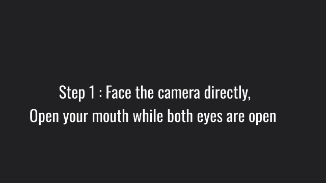
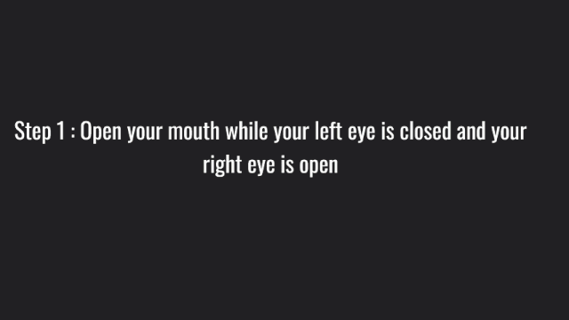

# Control-Mouse-Pointer-By-Head-Motions
Using a camera and head movements to control the mouse cursor to perform tasks such as clicking, moving, drag and scrolling.
## How to run
### Clone the repository
```bash
git clone https://github.com/LongThien91/Control-Mouse-Pointer-By-Head-Motions.git
```
### Install requirement
```bash
pip install -r requirements.txt
```
### run python file
```bash
py HMCP.py
```
## How to use
This project contains 4 mode:  
Mode 1: Move and click the mouse cursor     


Mode 2: Moving and drag the mouse cursor  
  
Mode 3: Scroll  


